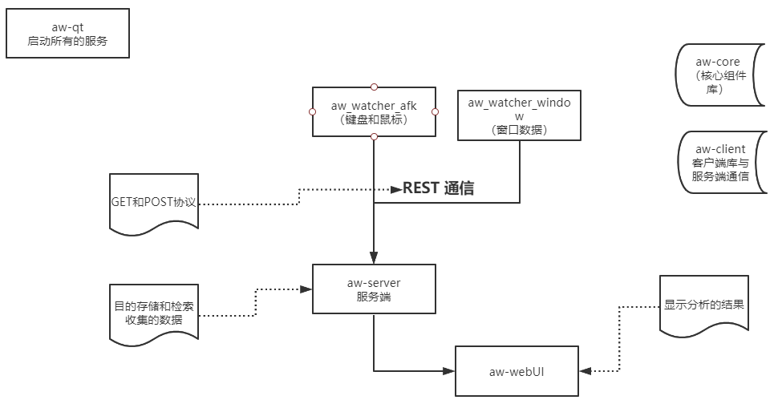

###  开源代码

- `注:`此文档为一些总结和开源文档的翻译具体实现细节参考官方文档
- 文档：https://docs.activitywatch.net/en/latest/getting-started.html
- code：https://github.com/ActivityWatch/activitywatch


- 

  


### 流程图




### 观察器详细介绍

#### aw_watcher_afk模块

`目的`：检测鼠标键盘是否是活跃决定是否是AFK（away from keyboard 简称长时间没有移动鼠标或者敲击键盘）

`建立流程:`

1. 导入配置包括轮询时间设置
2. 设置log配置记录
3. 调用ActivityWatchClient实现一个客户端的建立（`ActivityWatchClient` 一个围绕aw-server REST API的方便的封装器。是与服务器交互的推荐方式。）
4. 创建一个create_bucket，注意一个观察器建立一个bucket，类似于用于存放所有数据的一个bucket
5. 心跳循环发送当前活跃窗口的应用和标题名字（通过`Xlib`）


`注意点:`

- 其中主要的GET，POST采用异步的任务队列来出来每一个任务

  ```
  请求：http://localhost:5600/api/0/buckets/ 等等
  
  ```

  


### 总结

- 服务器与客户端通信http的REST，客户端类定义了与客户端通信aw-server REST API，以推荐的方式与服务器进行交互
- 数据库使用的为peewee来实现的
- 


### 存在的问题

- 当点击计算器时窗口被计算器捕获，但是当不使用计算器 鼠标移动到其他地方但是焦点还在计算器上就会造成计算器时间一直增加


### 观察器种类

特性：支持开发插件做自己的观察器

窗口程序

- [aw-watcher-afk](https://github.com/ActivityWatch/aw-watcher-afk)  观察鼠标和键盘的活动来检测是否用户是活跃的
- [aw-watcher-window](https://github.com/ActivityWatch/aw-watcher-window) 观察活跃的窗口和它的标题

浏览器

- [aw-watcher-web ](https://github.com/ActivityWatch/aw-watcher-web) 观察浏览器活跃的页的标题、URL、隐秘状态

编辑器

介绍：观察活跃的编辑文件和相关的元数据如路径、语言、项目名称等等

- [aw-watcher-vim](https://github.com/ActivityWatch/aw-watcher-vim) - vim extension, by [@johan-bjareholt](https://github.com/johan-bjareholt) and [@ahnlabb](https://github.com/ahnlabb).
- [aw-watcher-vscode](https://github.com/ActivityWatch/aw-watcher-vscode) - Visual Studio Code extension, by [@Otto-AA](https://github.com/Otto-AA).
- [pauldub/activity-watch-mode](https://github.com/pauldub/activity-watch-mode) - emacs mode forked from wakatime-mode, by [@pauldub](https://github.com/pauldub).
- [OlivierMary/aw-watcher-jetbrains](https://github.com/OlivierMary/aw-watcher-jetbrains) - JetBrains IntelliJ plugin, by [@OlivierMary](https://github.com/OlivierMary).
- [LaggAt/ActivityWatchVS](https://github.com/LaggAt/ActivityWatchVS) - Visual Studio extension, by [@LaggAt](https://github.com/LaggAt)
- [pascalwhoop/aw-idea](https://github.com/pascalwhoop/aw-idea) - (WIP) JetBrains IntelliJ IDEA/PyCharm/WebStorm/etc extension forked from wakatime, by [@pascalwhoop](https://github.com/pascalwhoop)
- [kostasdizas/aw-watcher-sublime](https://github.com/kostasdizas/aw-watcher-sublime) - Sublime Text 3, by [@kostasdizas](https://github.com/kostasdizas) (unmaintained)
- [prplecake/aw-watcher-sublimetext](https://github.com/prplecake/aw-watcher-sublimetext) - Sublime Text 3, by [@prplecake](https://github.com/prplecake) (fork of aw-watcher-sublime above, maintained)
- [NicoWeio/aw-watcher-atom](https://github.com/NicoWeio/aw-watcher-atom) - Atom, by [@NicoWeio](https://github.com/NicoWeio)


媒体观察器


其他的观察器

- [Alwinator/aw-watcher-table](https://github.com/Alwinator/aw-watcher-table) 监视你是否将高度可调的状态栏设置为横或竖
- [aw-watcher-input](https://github.com/ActivityWatch/aw-watcher-input)  监控按键的数量和鼠标移动的距离
- [aw-watcher-tmux](https://github.com/akohlbecker/aw-watcher-tmux) 监控终端的
- 


### install

```shell
sudo apt install python3-appdirs python3-deprecation python3-iso8601 python3-persist-queue python3-xlib timeslot python3-peewee python3-flask python3-flask-cors python3-pymongo

pip install tomlkit python_json_logger flask_restx logger pynput 
```


