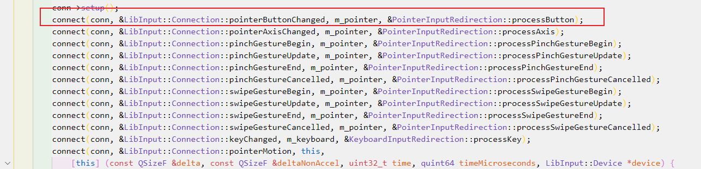

### 输入重定向类(InputRedirection ) （input.cpp）

#### 简介：

- 该类负责将传入的`输入重定向`到当前有输入或发送进入/离开事件的界面。
- 此外在传递给界面之前，输入被拦截，以使KWin的内部区域 首先获得输入（例如屏幕边缘），如果我们目前有输入事件，则将其过滤掉。

#### 重定向事件类

- 包含了`键盘事件类`、`鼠标事件类`、`触摸事件类`、`快捷键事件类`等等的事件重定向

- 快捷键类（GlobalShortcutsManager）(globalshortcuts.cpp)

  - 管理KWin内部的全局快捷方式。

  -  这个类负责保存所有的全局快捷方式并处理按键事件。 也就是在有匹配的情况下触发一个快捷方式。 对于内部快捷方式的处理（那些在KWin内部交互的快捷方式），QActions被使用并在快捷方式匹配时被触发。如果快捷方式匹配，就会触发。对于外部快捷方式的处理，则使用DBus接口。

- 鼠标类（PointerInputRedirection）(pointer_input.cpp)

  - 关于鼠标的各种处理包括`光标图标`、`鼠标的按压释放`、`鼠标的移动`、`鼠标中键`等等

- 触摸输入类（TouchInputRedirection）(touch_input.cpp)

  - 

- 键盘事件类（KeyboardInputRedirection）

  - 关于键盘的`按压键值`、`键值的映射`等等

  

### 外部Kwin资料

- kwin_API：https://develop.kde.org/docs/plasma/kwin/api/ 
- KDE：https://develop.kde.org/docs/
- 窗口的基础解释：https://docs.microsoft.com/zh-cn/windows/win32/winmsg/about-windows?redirectedfrom=MSDN

### compositor 合成器

窗口管理器，为应用程序的每个窗口提供一个离屏缓冲区，窗口管理合成窗口的buffer到一张表示屏幕图像和写结果到显示内存种

### XKB

- 文件名xkb.cpp 类名xkb
- 简介：用于键盘的映射、键盘的布局、ALT、SHIFT、键盘灯一些控制
- 库：libxkbcommon-dev 
- 特性：
  - enhanced support for *[modifiers](https://en.wikipedia.org/wiki/Modifier_key)* ([Alt](https://en.wikipedia.org/wiki/Alt_key), ⇧ [Shift](https://en.wikipedia.org/wiki/Shift_key), etc.);
  - better treatment of *key groups* (typically [keyboard layouts](https://en.wikipedia.org/wiki/Keyboard_layout));
  - extended control of keyboard indicators ([LEDs](https://en.wikipedia.org/wiki/LED)) and [bells](https://en.wikipedia.org/wiki/Bell_character);
  - various new keyboard parameters (controls);
  - association of actions (of a particular kind) to keys.

