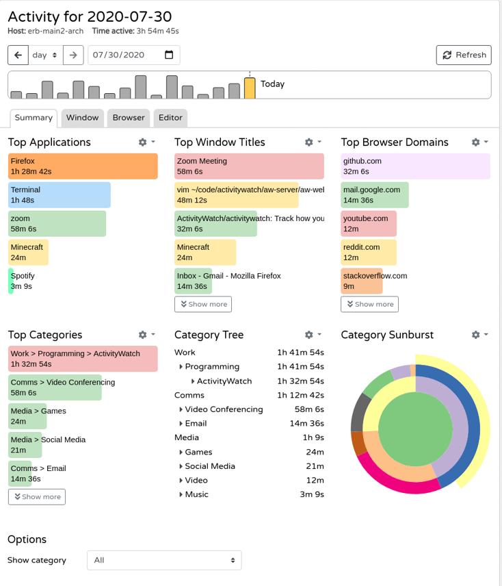
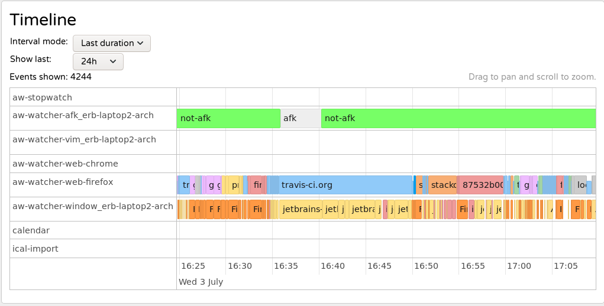
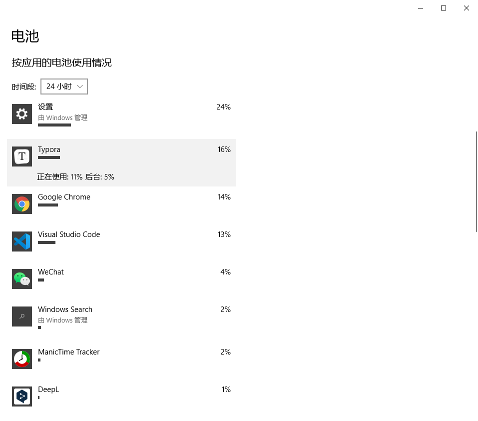
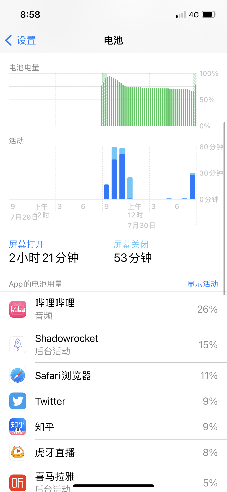
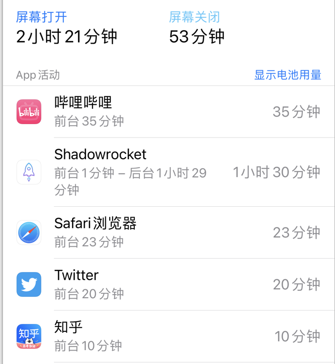
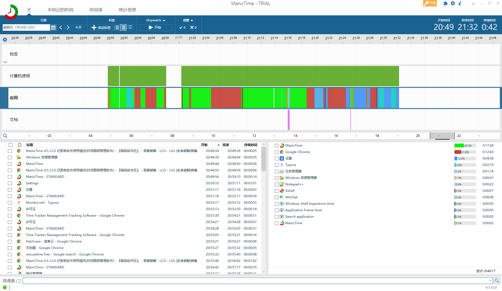
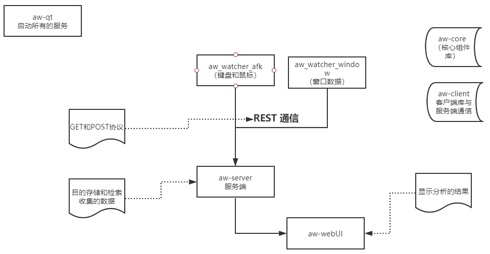
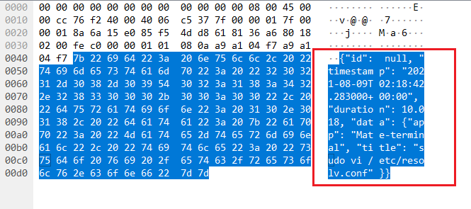
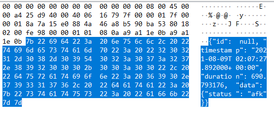
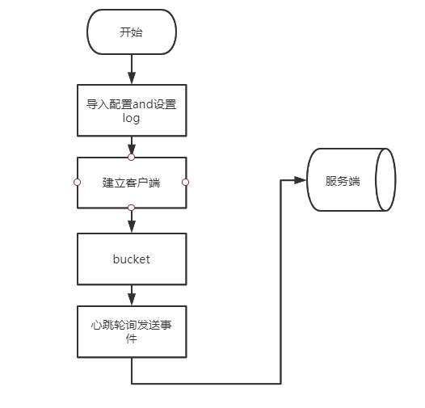

[TOC]


### 个人时间追踪/分析软件（效率软件）

`前言：`它是一款软件，可以在后台无时无刻记录你操作电脑的动作，通过精致的视图向你展示当天使用最久的程序，投入最深的工作，以及那些浪费时间的“罪魁祸首”。让你更好地去分析过去的时间、规划未来的时间。


#### 功能介绍

自动记录你的电脑使用情况

- 记录你使用了哪些应用程序以及使用了多长时间。

- 记录你访问过哪些网站

- 记录你在哪些文件上工作过。

- 什么时候使用电脑，什么时候离开电脑

  

#### 概略图

开源ActivityWatch软件概略图




时间轴




#### 拓展-App的电池用量统计

`简介：`在此开源的软件上还能拓展那些功能，经过一些调研Windows和iPhone上电源耗电量统计的界面。所有这些App的用电量统计使用的是根据App的使用时间来统计的，包括应用的前台和后台使用的时间，计算每个应用所占百分比，来统计App的用电量。


##### Windows上的电池使用量统计




##### iPhone App用电量统计




##### 应用的使用时间统计




##### 总结

在此开源代码的基础上由于是统计所有应用的使用时长，根据App使用的时长，可以计算出大概的App用电量情况。


#### 存在的问题

开发此应用设计到的难点以及工作点

1. 目前开源使用的是Web展示的数据，需要使用Qt写应用的界面
2. 代码重构，打包形式为deb包的形式
3. 电源统计怎么与应用时长进行结合统计App的用电量
4. 提高统计应用时长的准确度


Qt界面展示Windows上类似的软件`ManicTime`




### ActivityWatch 技术实现介绍

`简介:` 介绍开源ActivityWatch实现统计应用使用时长的技术点


####  开源代码

- `注:`此文档为一些总结和开源文档的翻译具体实现细节参考官方文档
- 文档：https://docs.activitywatch.net/en/latest/getting-started.html
- code：https://github.com/ActivityWatch/activitywatch

#### 开源的权限

- 使用MPL 2.0协议同著名的GPL许可证和BSD许可证相比，MPL在许多权利与义务的约定方面与它们相同
- 商业软件可以使用修改后的代码版权归软件的发起者。


#### 流程图（`待完善`）




介绍： `aw_aw_watcher_afk 和 aw_wathcer_window` 称为鼠标键盘和应用窗口的观察器。`aw-server`主要是用来存储数据的所有的数据存储在此，`aw-qt` 服务的管理 托盘图标，来控制服务器和客户端的启动


主要是 `aw_aw_watcher_afk 和 aw_wathcer_window`采集数据包括窗口的应用名称标题名以及鼠标的事件，发送到服务端进行统计存储，进行整理分析，通过调用API接口获取数据来显示。


##### aw_watcher_window模块

`目的：` 观察焦点窗口应用名称和窗口标题

`建立流程:`

1. 导入配置包括轮询时间设置

2. 设置log配置记录

3. 调用ActivityWatchClient实现一个客户端的建立（`ActivityWatchClient` 一个围绕aw-server REST API的方便的封装器。是与服务器交互的推荐方式。）

4. 创建一个create_bucket，注意一个观察器建立一个bucket，类似于用于存放所有数据的一个bucket

5. 心跳循环发送当前焦点窗口的应用和标题名字（通过`Xlib`）
   - 首选获取活跃的窗口的ID
   - 再通过窗口ID拿到这个窗口的句柄
   - 再获取窗口的类型也就是窗口的应用名称appname
   - 拿到窗口的标题
   
6. json数据发送的格式

   ```js
   event = {
     "timestamp": "2016-04-27T15:23:55Z",  // ISO8601 格式的时间戳
     "duration": 1,                     // 持续时间
     "data": {"app": "kylin-calculator", "title": "麒麟计算器"},  // JSON对象, 事件的类型
   }
   ```

   

7. 合并事件或者直接提交到数据库

   合并事件的要求

   1. 事件的类型发生变化 比如kylin-calculator -> ublock 
   2. 超过最大的发送请求间隔事件，默认10S duration > 10S 
   
8. 使用`异步任务队列`处理发送事件请求(未深入了解)

9. GET/POST REST 请求到服务端进行存储 

   window窗口的抓包

   ```http
   POST /api/0/buckets/aw-watcher-window_pc/heartbeat?pulsetime=2.0
   ```

   

   

   ```http
   POST /api/0/buckets/aw-watcher-afk_pc/heartbeat?pulsetime=185
   ```

   

10. `存在的问题`

    无法获取Wayland应用的窗口名称，由于wayland的协议不支持导致的问题，Wayland协议为了保证安全不能直接获取焦点窗口，导致无法获取，目前的解决办法是通过Kwin提供Dbus的接口来获取窗口。





##### aw_watcher_afk模块

`目的`：检测鼠标键盘是否是活跃决定是否是AFK（away from keyboard 简称长时间没有移动鼠标或者敲击键盘）

此模块的与window类似，不同在于


`注意点:`

- 其中主要的GET，POST采用异步的任务队列来出来每一个任务

  ```js
  请求：http://localhost:5600/api/0/buckets/ 
  
  ```


#### 目录

目录结构的控制代码在`aw-core/dirs.py` 

- 详细资料参考：https://docs.activitywatch.net/en/latest/directories.html

- 

  ```sh
  - 配置文件目录 `~/.config/activitywatch` 
  - log日志目录 `~/.cache/activitywatch/log`
  - 缓存位置 `~/.cache/activitywatch`
  - 数据 `~/.local/share/activitywatch`
  
  ```

  

#### 数据模型

源文档链接：https://docs.activitywatch.net/en/latest/buckets-and-events.html

数据模型为此监控功能的核心，数据的传输和存储定义

##### Buckets 

- 简介：每个Buckets 都包含一系列的事件和这些事件的元数据（如它们的类型和收集它们的东西），每一个观察器都有一个Bucket，一个Bucket应该总是从同一个来源接收数据。例如如果想写一个观察器来追踪当前活跃的窗口，我们首先创建一个Bucket然后开始报告事件到这个Bucket中（使用心跳完成）

- 数据格式

  ```json
  bucket = {
    "id": "aw-watcher-test_myhostname",
    "created": "2017-05-16T13:37:00.000000",
    "name": "A short but descriptive human readable bucketname",
    "type": "com.example.test",       // Type of events in bucket
    "client": "example-watcher-test", // Identifier of client software used to report data
    "hostname": "myhostname",         // Hostname of device where data was collected
  }
  ```

  

##### Events

所有的时间戳被存储使用的是UTC时间，会存在时区的偏差，目前这些时间差的处理在显示数据客户端进行处理计算偏差。所查询出来的时间都是会存在偏差的

- json格式

  ```js
  event = {
    "timestamp": "2016-04-27T15:23:55Z",  // ISO8601 formatted timestamp
    "duration": 3.14,                     // Duration in seconds
    "data": {"key": "value"},  // A JSON object, the schema of this depends on the event type
  }
  ```

  

##### Heartbeats

Heartbeats是为了合并具有相同数据的相邻事件（`pulsetime`在一个时间窗内），这样做有利于保存数据在硬盘上。

合并事件A和B如果他们`data`是相同的和时间戳是在`pulsetime`在一个时间窗内。由此产生的事件将具有更早的时间戳，一个持续时间，以配合时间戳之间的差异。

查看例子 [`aw_transform.heartbeat_merge()`](https://docs.activitywatch.net/en/latest/api/python.html#aw_transform.heartbeat_merge) or the [heartbeat REST API](https://docs.activitywatch.net/en/latest/api/rest.html#heartbeat-api).

此`heartbeat REST API`为经常使用的API客户端请求数据到服务端

```http
POST /api/0/buckets/<bucket_id>/heartbeat
```


#### Event types

##### currentwindow 窗口

- 数据格式

  ```json
  {
      app: string,
      title: string,
  }
  ```

  

##### afkstatus AFK 鼠标键盘

- 数据类型

  ```json
  {
      status: string   // "afk" or "not-afk"
  }
  ```

  


其他事件类型待完善


#### API 参考

##### REST API

在ActivityWatch中客户端与服务端的通信都使用的是REST API，


##### aw_transform

包含了在查询语言中所使用的一些事件类型转换


#### 代码结构

`aw-core` ActivityWatch 的核心库 其他的库都会调用这个库的组件 

- `aw_core`  包含了基础的数据类型和工具，比如`Event`类、用于配置的辅助工具、日志和buckets、事件、导出等等
- `aw_datastore`  包含了数据存储类被aw-server-python使用
- `aw_transform` 查询中使用的所有事件转换。
- `aw_query` ActivityWatch 使用的查询语言


`aw-client ` ActivityWatch 的客户端库各种API主要作为两种

- 一个观察器调用API发送数据到服务器端来存储
- 一个显示获取数据 
- 其中数据的存储和发送都是到`aw-server`
- 客户端和服务端进行交互使用的是 `REST API`(get post)进行通信的


`qw-qt` 目的：服务的管理 托盘图标


#### 服务器

`aw-server`  目的存储和检索收集的数据

- `aw-webui`搭建web界面使用`vus.js`来开发的界面

- `aw_server` 使用Flask来搭建web服务器

  

#### 观察器

`aw_watcher_afk` 目的检测鼠标键盘是否是活跃决定是否是AFK（away from keyboard 简称长时间没有移动鼠标或者敲击键盘）

- 记录鼠标和键盘的两个参数 一记录上一次`鼠标键盘移动的时间`和`两次鼠标移动的时间间隔`
- 通过超时来判断是否是AFK
- 使用心跳包来发送事件的间隔
- 配置中来设置超时和心跳间隔时间
- 提交一次事件

`aw_watcher_window` 观察活跃的窗口和它的标题

- 主要通过xlib获取窗口的名称和标题 再通过发送时间到收集数据的地方
- 间隔检测时间1S 记录时间发送心跳包到服务端

`总结`：其中收集数据的观察器不难 主要是所有数据的分析 展示一些数据


提示：

所有的模块开启debug模式使用 例如`aw-watcher-window --testing`


### install

```shell
sudo apt install python3-appdirs python3-deprecation python3-iso8601 python3-persist-queue python3-xlib  python3-peewee python3-flask python3-flask-cors python3-pymongo python3-pip python3-pyqt5

pip install tomlkit python_json_logger flask_restx logger pynput timeslot

sudo ln -s /usr/bin/python3 /usr/bin/python
```

其他安装


